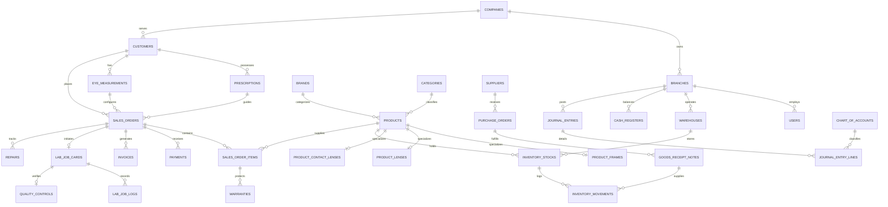
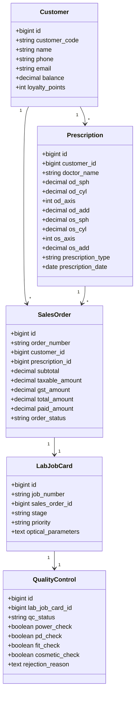

# Optical Store Management ERP — Entity Relationship Diagrams

```mermaid
erDiagram
    COMPANIES ||--o{ BRANCHES : owns
    BRANCHES ||--o{ USERS : employs
    BRANCHES ||--o{ WAREHOUSES : operates
    COMPANIES ||--o{ CUSTOMERS : serves
    CUSTOMERS ||--o{ PRESCRIPTIONS : possesses
    CUSTOMERS ||--o{ EYE_MEASUREMENTS : has
    CUSTOMERS ||--o{ SALES_ORDERS : places

    SALES_ORDERS ||--o{ SALES_ORDER_ITEMS : contains
    SALES_ORDERS ||--o{ PAYMENTS : receives
    SALES_ORDERS ||--o{ INVOICES : generates
    SALES_ORDERS ||--o| LAB_JOB_CARDS : initiates
    
    PRESCRIPTIONS ||--o{ SALES_ORDERS : guides
    EYE_MEASUREMENTS ||--o{ SALES_ORDERS : configures

    LAB_JOB_CARDS ||--o{ LAB_JOB_LOGS : records
    LAB_JOB_CARDS ||--o| QUALITY_CONTROLS : verifies

    BRANDS ||--o{ PRODUCTS : categorizes
    CATEGORIES ||--o{ PRODUCTS : classifies
    PRODUCTS ||--o| PRODUCT_FRAMES : specializes
    PRODUCTS ||--o| PRODUCT_LENSES : specializes
    PRODUCTS ||--o| PRODUCT_CONTACT_LENSES : specializes
    PRODUCTS ||--o{ INVENTORY_STOCKS : holds
    PRODUCTS ||--o{ SALES_ORDER_ITEMS : supplies

    WAREHOUSES ||--o{ INVENTORY_STOCKS : stores
    INVENTORY_STOCKS ||--o{ INVENTORY_MOVEMENTS : logs

    SUPPLIERS ||--o{ PURCHASE_ORDERS : receives
    PURCHASE_ORDERS ||--o{ GOODS_RECEIPT_NOTES : fulfills
    GOODS_RECEIPT_NOTES ||--o{ INVENTORY_MOVEMENTS : supplies

    SALES_ORDERS ||--o{ REPAIRS : tracks
    SALES_ORDER_ITEMS ||--o{ WARRANTIES : protects

    BRANCHES ||--o{ CASH_REGISTERS : balances
    BRANCHES ||--o{ JOURNAL_ENTRIES : posts
    CHART_OF_ACCOUNTS ||--o{ JOURNAL_ENTRY_LINES : classifies
    JOURNAL_ENTRIES ||--o{ JOURNAL_ENTRY_LINES : details
```

## Entity Details & Keys

```mermaid
classDiagram
    class Customer {
        +bigint id
        +string customer_code
        +string name
        +string phone
        +string email
        +decimal balance
        +int loyalty_points
    }
    class Prescription {
        +bigint id
        +bigint customer_id
        +string doctor_name
        +decimal od_sph
        +decimal od_cyl
        +int od_axis
        +decimal od_add
        +decimal os_sph
        +decimal os_cyl
        +int os_axis
        +decimal os_add
        +string prescription_type
        +date prescription_date
    }
    class SalesOrder {
        +bigint id
        +string order_number
        +bigint customer_id
        +bigint prescription_id
        +decimal subtotal
        +decimal taxable_amount
        +decimal gst_amount
        +decimal total_amount
        +decimal paid_amount
        +string order_status
    }
    class LabJobCard {
        +bigint id
        +string job_number
        +bigint sales_order_id
        +string stage
        +string priority
        +text optical_parameters
    }
    class QualityControl {
        +bigint id
        +bigint lab_job_card_id
        +string qc_status
        +boolean power_check
        +boolean pd_check
        +boolean fit_check
        +boolean cosmetic_check
        +text rejection_reason
    }

    Customer "1" --> "*" Prescription
    Customer "1" --> "*" SalesOrder
    Prescription "1" --> "*" SalesOrder
    SalesOrder "1" --> "1" LabJobCard
    LabJobCard "1" --> "1" QualityControl
```

